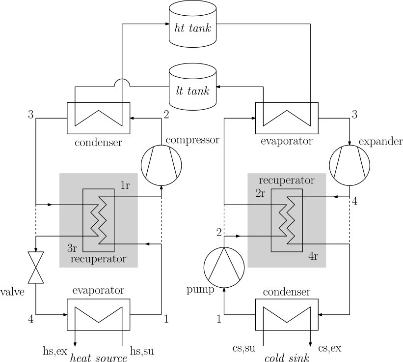

# CBSim - Carnot Battery Simulator

The Carnot Battery Simulator (CBSim) provides thermodynamic models for various Carnot battery architectures. It can be used to carry out energy and exergy analyses of thermally integrated pumped thermal energy storage (TI-PTES).<br>
CBSim is open-source and publicly available on GitHub at <https://github.com/laterrea/CBSim>.

<p align="center">
  
</p>

Model overview
==============

The model can represent basic (B) and recuperated (R) cycles. The regime, either subcritical (S) or transcritical (T), can also be chosen. Two-tank sensible heat thermal energy storage is considered by default, but the code can easily be adapted to represent other forms of storage (latent heat, single tank, etc.).
<p align="center">
  
</p>

References
==========

The model has been used in the following publications:
* A. Laterre, D. Coppitters, V. Lemort and F. Contino, "Designing small-scale Rankine Carnot batteries that suit your preferences: A near-optimal approach", *Journal of Energy Storage*, vol. 141, p. 118650, Jan. 2026.<br>
  <https://doi.org/10.1016/j.est.2025.118650>
* A. Laterre, "Carnot batteries for heat and power coupling : energy, exergy, economic and environmental (4E) analysis", *PhD thesis*, Université catholique de Louvain and Université de Liège, Jun. 2025.<br>
  <http://hdl.handle.net/2078.1/302587>
* R. Tassenoy, A. Laterre, V. Lemort, F. Contino, M. De Paepe, and S. Lecompte, "Assessing the influence of compressor inertia on the dynamic performance of large-scale vapor compression heat pumps for Carnot batteries", *Journal of Energy Storage*, vol. 101, p. 113948, Nov. 2024.<br>
  <https://doi.org/10.1016/j.est.2024.113948>
* A. Laterre, O. Dumont, V. Lemort and F. Contino, "Extended mapping and systematic optimisation of the Carnot battery trilemma for sub-critical cycles with thermal integration", *Energy*, vol. 304, p. 132006, Sep. 2024.<br>
  <https://doi.org/10.1016/j.energy.2024.132006>
* A. Laterre, O. Dumont, V. Lemort and F. Contino, "Is waste heat recovery a promising avenue for the Carnot battery? Techno-economic optimisation of an electric booster-assisted Carnot battery integrated into different data centres", *Energy Conversion and Management*, vol. 301, p. 118030, Feb. 2024.<br>
  <https://doi.org/10.1016/j.enconman.2023.118030>

Cite CBSim
==========

Please use the following reference to cite CBSim when you use it for any publication:
> A. Laterre, D. Coppitters, V. Lemort and F. Contino, "Designing small-scale Rankine Carnot batteries that suit your preferences: A near-optimal approach", *Journal of Energy Storage*, vol. 141, p. 118650, Jan. 2026.<br>
> <https://doi.org/10.1016/j.est.2025.118650>

Documentation
=============

The full documentation is not available yet. However, the essential information required to get started with CBSim is summarised below.<br>
For questions, you can contact <antoine.laterre@uclouvain.be>.

The ```main.py``` files contain the scripts to evaluate the cycles:
* ```main_hp.py```: main script to simulate the heat pumps (vapour compression heat pumps, VCHP);
* ```main_he.py```: main script to simulate the heat engines (organic Rankine cycles, ORC);
* ```main_cb.py```: main script to simulate the Carnot batteries (heat pump and heat engine connected via storage).

The ```\src``` folder contains the source files in which the cycles models are implemented:
* ```_module_heat_pump.py```: heat pumps models;
* ```_module_heat_engine.py```: heat engines models;
* ```_module_carnot_battery.py```: Carnot battery models (based on ```_module_heat_pump.py``` and ```_module_heat_engine.py```);
* ```_module_plots.py```: plot functions for post-processing.

A total of 16 Carnot battery configurations can be represented:
1. **SBVCHP + SBORC**: _Subcritcal Basic Vapour Compression Heat Pump + Subcritcal Basic Organic Rankine Cycle_
2. **SBVCHP + SRORC**: _Subcritcal Basic Vapour Compression Heat Pump + Subcritcal Recuperated Organic Rankine Cycle_
3. **SRVCHP + SBORC**: _Subcritcal Recuperated Vapour Compression Heat Pump + Subcritcal Basic Organic Rankine Cycle_
4. **SRVCHP + SRORC**: _Subcritcal Recuperated Vapour Compression Heat Pump + Subcritcal Recuperated Organic Rankine Cycle_
5. **SBVCHP + TBORC**: _Subcritcal Basic Vapour Compression Heat Pump + Transcritical Basic Organic Rankine Cycle_
6. **TBVCHP + SBORC**: _Transcritical Basic Vapour Compression Heat Pump + Subcritcal Basic Organic Rankine Cycle_
7. **SRVCHP + TBORC**: _Subcritcal Recuperated Vapour Compression Heat Pump + Transcritical Basic Organic Rankine Cycle_
8. **TBVCHP + SRORC**: _Transcritical Basic Vapour Compression Heat Pump + Subcritcal Recuperated Organic Rankine Cycle_
9. **TBVCHP + TBORC**: _Transcritical Basic Vapour Compression Heat Pump + Transcritical Basic Organic Rankine Cycle_
10. **SBVCHP + TRORC**: _Subcritcal Basic Vapour Compression Heat Pump + Transcritical Recuperated Organic Rankine Cycle_
11. **TRVCHP + SBORC**: _Transcritical Recuperated Vapour Compression Heat Pump + Subcritcal Basic Organic Rankine Cycle_
12. **SRVCHP + TRORC**: _Subcritcal Recuperated Vapour Compression Heat Pump + Transcritical Recuperated Organic Rankine Cycle_
13. **TRVCHP + SRORC**: _Transcritical Recuperated Vapour Compression Heat Pump + Subcritcal Recuperated Organic Rankine Cycle_
14. **TBVCHP + TRORC**: _Transcritical Basic Vapour Compression Heat Pump + Transcritical Recuperated Organic Rankine Cycle_
15. **TRVCHP + TBORC**: _Transcritical Recuperated Vapour Compression Heat Pump + Transcritical Basic Organic Rankine Cycle_
16. **TRVCHP + TRORC**: _Transcritical Recuperated Vapour Compression Heat Pump + Transcritical Recuperated Organic Rankine Cycle_

The model comes with a post-processing library to depict the temperature–enthalpy and temperature–entropy diagrams.
<div style="display:flex; flex-wrap:wrap; justify-content:space-between; align-items:center; width:100%;">
  
  
  
  
  
  
</div>
